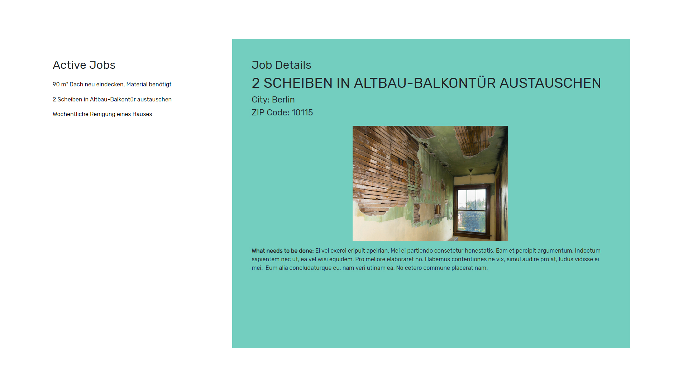

# Two panel layout



> A quick walkthrough of my first Angular app built using the Angular CLI, version 7.1.2

## See it live

[Two Panel Layout built in Angular] (https://mihneavlad.github.io/angular-bootstrap-myhammer/)

## App Info

```bash
# Install dependencies for server
npm install

# Run the client

Run `ng serve` for a dev server. Navigate to `http://localhost:4200/`. The app will automatically reload if you change any of the source files.
```
### Author

Mihnea Vlad


